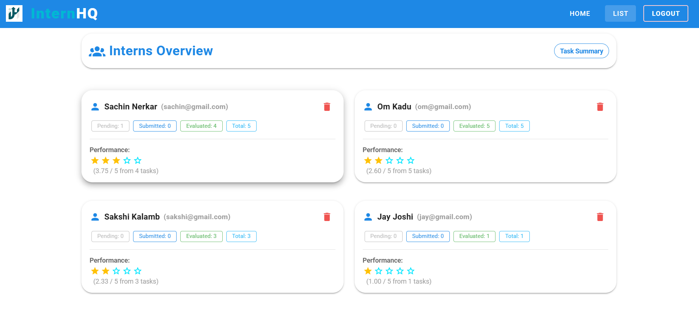
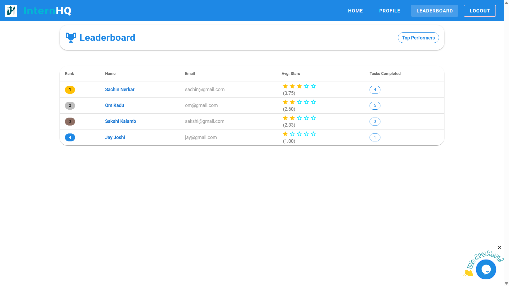

# InternHQ – MEVN Stack Internship Management System

## Table of Contents

- [Overview](#overview)
- [Tech Stack](#tech-stack)
- [Features](#features)
- [Project Structure](#project-structure)
- [Setup & Installation](#setup--installation)
- [Usage & Flow](#usage--flow)
- [API Endpoints](#api-endpoints)
- [Screnshots](#screenshots)
- [Contributing](#contributing)

---

## Overview

**InternHQ** is a full-stack internship management platform built with the MEVN stack (MongoDB, Express.js, Vue.js, Node.js). It allows admins to create and assign tasks to interns, track submissions, evaluate performance, and view analytics and leaderboards. Interns can view, submit, and edit their assignments, as well as track their progress and feedback.

---

## Tech Stack

- **Frontend:** [Vue.js 2](https://vuejs.org/), [Vuetify](https://vuetifyjs.com/), [Vue Router](https://router.vuejs.org/), [Vuex](https://vuex.vuejs.org/), [Chart.js](https://www.chartjs.org/), [Vue-Toastification](https://vue-toastification.maronato.dev/)
- **Backend:** [Node.js](https://nodejs.org/), [Express.js](https://expressjs.com/), [MongoDB (Mongoose)](https://mongoosejs.com/)
- **Authentication:** [JWT (JSON Web Tokens)](https://jwt.io/)
- **Other:** [Axios](https://axios-http.com/), [CORS](https://expressjs.com/en/resources/middleware/cors.html), [dotenv](https://github.com/motdotla/dotenv), [nodemon](https://nodemon.io/)

---

## Features

### Admin
- Register/login as admin
- Create and assign tasks to all interns
- View all tasks and their assignments
- Evaluate intern submissions (feedback & star rating)
- View analytics (charts for completion, scores, activity)
- Manage interns (view, delete)
- View leaderboard

### Intern
- Register/login as intern
- View assigned tasks
- Submit and edit task submissions (GitHub link)
- View feedback and ratings from admin
- Track task status (pending, submitted, evaluated)
- View personal performance and leaderboard

---

## Project Structure
```
Apexa Project/
├── backend/         # Express backend (API, DB, Auth)
│   └── routes/
│   └── middleware/
│   └── models/
│   └── db.js
│   └── index.js
|   └── package-lock.json
|   └── package.json
├── frontend/            # Vue+Vuetify frontend
|   ├── public/
|   ├── src/
│       └── components/
|       └── assets/
|       └── plugins/
|       └── router/
|       └── store/
|       └── views/
|       └── App.vue
|       └── mian.js
│   ├── .gitignore
│   ├── babel.config.js
│   ├── jsconfig.json
│   ├── package-lock.json
│   ├── package.json
│   ├── README.md
│   ├── vue.config.js
├── .gitignore
├── package.json
├── package-lock.json
└── README.md

```
---

## Setup & Installation

### Prerequisites

- Node.js & npm
- MongoDB

### 1. Clone the repository

```sh
git clone <repo-url>
cd Apexa Project
```
### 2. Install dependencies
#### Backend
```sh
cd backend
npm install
```
#### Frontend
```sh
cd ../frontend
npm install
```

### 3. Start MongoDB
- Make sure MongoDB is running locally on mongodb://localhost:27017/apexa-project

### 4. Run the project
- From the root directory:
```sh
# Start both frontend and backend concurrently
npm run both
```
- Or run separately:
```sh
# In one terminal
npm run backend

# In another terminal
npm run serve
```
- Frontend: http://localhost:8080
- Backend API: http://localhost:5000

## Usage & Flow
### Registration & Login
- Admin and Interns can register and log in.
- Role is determined by the isAdmin flag.
### Admin Flow
- Login as admin.
- Create new tasks (auto-assigned to all interns).
- View all tasks, assignments, and intern list.
- Evaluate submissions (feedback & stars).
- View analytics and leaderboard.
- Manage interns (delete if needed).


### Intern Flow
- Login as intern.
- View assigned tasks.
- Submit GitHub link for each task.
- View feedback and ratings after evaluation.
- Edit submission after evaluation if needed.
- Track performance and view leaderboard.


## API Endpoints
### Auth
- `POST /api/auth/createuser` – Register (admin/intern)
- `POST /api/auth/login` – Login
- `GET /api/auth/getuser` – Get logged-in user details
- `DELETE /api/auth/admin/interns/:internId` – Delete intern (admin only)

### Tasks
- `POST /api/tasks` – Create task (admin)
- `GET /api/tasks/admin` – Get all tasks (admin)
- `GET /api/tasks/assigned` – Get assigned tasks (intern)
- `PUT /api/tasks/submit/:taskId` – Submit/edit task (intern)
- `PUT /api/tasks/evaluate/:assignmentId` – Evaluate task (admin)
- `GET /api/tasks/:taskId/submissions` – Get submissions for a task (admin)
- `GET /api/tasks/admin/interns` – Get all interns with stats (admin)
- `GET /api/tasks/performance` – Get intern's average stars (intern)
- `DELETE /api/tasks/:taskId` – Delete task (admin)
- `GET /api/tasks/leaderboard` – Get leaderboard

## Screenshots
**Admins Only**

**Interns View**


 
---

## Contributing

I welcome contributions! To raise a Pull Request (PR):

1. **Fork** the repository.
2. **Create a new branch** for your feature or bugfix.
3. **Commit** your changes with clear messages.
4. **Push** to your fork and submit a **Pull Request**.
5. Please describe your changes and reference any related issues.

For major changes, please open an issue first to discuss what you would like to change.

---

